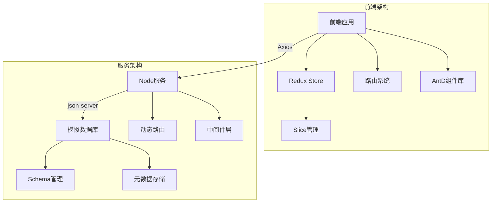

# mock-json-server

### 项目概述：全栈式数据库模拟管理平台

**技术驱动**：基于React + TypeScript的全栈解决方案，实现轻量级数据库服务模拟，为前后端分离开发提供高效协作环境
**核心价值**：通过可视化界面与RESTful API无缝衔接，赋能开发者快速构建、调试和管理模拟数据服务

------

### 技术架构全景

|    技术领域    |            技术选型            |                     核心作用                     |
| :------------: | :----------------------------: | :----------------------------------------------: |
|  **前端框架**  |    React 18 + TypeScript 5     |           构建类型安全的高性能前端应用           |
|  **状态管理**  | @reduxjs/toolkit + react-redux |   实现全局状态的可预测性管理，简化异步逻辑处理   |
|  **UI组件库**  |         Ant Design 5.x         |          快速搭建企业级可视化控制台界面          |
|  **路由管理**  |       react-router-dom 6       |            实现动态路由配置与权限控制            |
| **开发工具链** |          Vite 4 + SWC          |       毫秒级热更新开发体验，极速构建生产包       |
|  **数据模拟**  | mockjs 1.1 + json-server 0.17  |          动态生成RESTful API与仿真数据           |
|  **网络通信**  |    Axios 1.3 + RESTful规范     | 标准化前后端通信协议，实现请求拦截与统一错误处理 |

------

### 系统架构设计



------

### 

### 应用场景

- 🚀 **前端开发沙箱**：在后端未就绪阶段实现完整业务流程开发
- 🧪 **接口测试平台**：快速构造边界测试用例
- 🎓 **教学演示系统**：直观展示数据库工作原理
- 🛠️ **原型验证工具**：快速验证产品概念的最小可行方案

### 项目截图


### 运行项目
#### 运行前端
```bash
npm start
```
#### 运行服务端

```bash
# src/server
nodemon server.js
```
